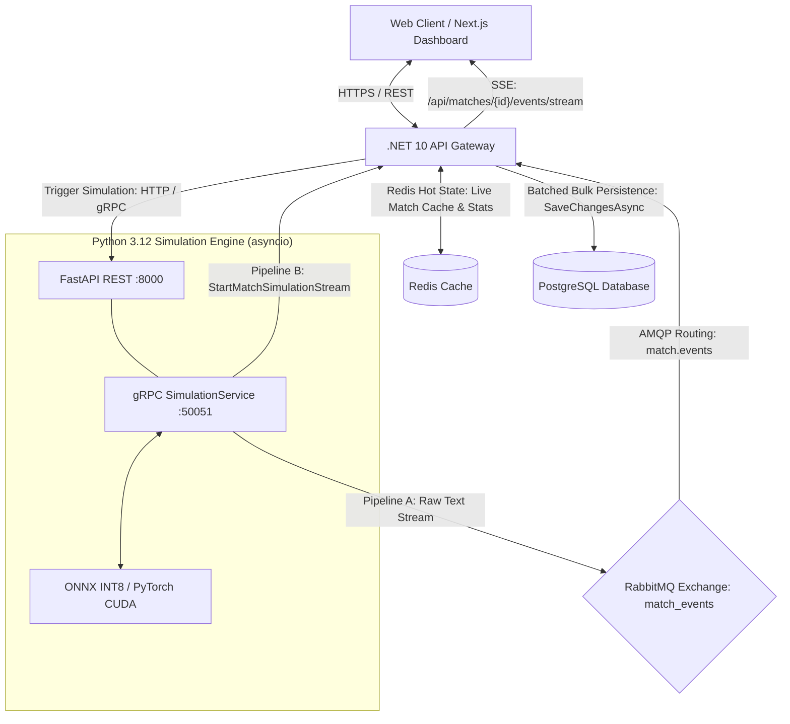

# PixelPitchAI — Football Match Simulation & Management Monorepo

[](https://github.com/Nader7x/Footex/actions/workflows/ci.yml)


PixelPitchAI is an enterprise-grade football management and live match simulation platform. It operates as a monorepo containing a high-performance .NET 10 backend, a real-time responsive Next.js frontend dashboard, and a dedicated Python AI simulation engine.

<video src="https://github.com/user-attachments/assets/4f688e9f-40d2-44fd-942f-53787ecd2d31"></video>

---

## 🏗️ System Architecture

PixelPitchAI implements a dual streaming event-driven architecture designed for high throughput, sub-millisecond parsing, and real-time live spectator broadcasting.



### Event Streaming & Ingestion Pipelines
* **Pipeline A (Durable RabbitMQ Stream)**: Asynchronous raw commentary text published to RabbitMQ exchange `match_events` (topic exchange, routing key `match.events`). Consumed by .NET `MatchEventRabbitMqClient`, parsed with zero allocations via `ZeroAllocationEventParser` (`ReadOnlySpan<char>`), and committed to PostgreSQL in batched transactions upon match completion.
* **Pipeline B (Direct gRPC Server-Streaming)**: Low-latency memory-to-memory streaming via `SimulationService.StartMatchSimulationStream` on port `50051` (`simulation.proto`), streamed directly to `MatchEventGrpcStreamConsumer`.
* **Client Match Streaming (Server-Sent Events)**: Live match events and statistics are broadcast to connected browsers exclusively via Server-Sent Events (SSE) at `GET /api/matches/{id}/events/stream` with JWT authorization (`?access_token=`). Channel-based `MatchEventBroadcaster` pushes structured `match_event` and `match_statistics` JSON payloads. *(Note: SignalR/WebSockets for live match simulation events are deprecated and replaced by SSE).*

---

## 📦 Component Layout

The monorepo consists of three core services:

### 1. ⚡ [Core API Backend](./backend)
An enterprise-grade, clean architecture backend built with **.NET 10 (C# 13)**.
* **Core Technologies**: ASP.NET Core, EF Core 10, PostgreSQL, Redis 7, RabbitMQ, Scalar API Reference, Server-Sent Events (SSE).
* **Key Features**: Reflection-free CQRS (45 compile-time DI handler registrations), high-performance user management, team databases, hot-state stats in Redis, and compile-time mapping via `Riok.Mapperly`.
* **Zero-Allocation & AOT Readiness**: Zero-allocation `ReadOnlySpan<char>` parsing (`ZeroAllocationEventParser`), source-generated JSON (`MatchEventJsonContext`), static DI, and compile-time logging.
* **API Documentation**: Interactive documentation powered by ASP.NET Core OpenAPI and Scalar at `http://localhost:5025/scalar/v1`.
* **Client Live Streaming**: Real-time match feed via Server-Sent Events at `GET /api/matches/{id}/events/stream`.

### 2. 🏟️ [Simulation Engine](./simulation-engine)
A high-performance AI text generation and event streaming microservice built on **Python 3.12** managed with **uv**.
* **Dual-Server Concurrency**: Concurrently runs two server interfaces within Uvicorn's `asyncio` lifespan loop:
  * FastAPI REST API on port 8000
  * gRPC `SimulationService` (defined in `simulation.proto`) on port 50051
* **gRPC Service (`port 50051`)**: Exposes unary RPC `StartMatchSimulation`, server-streaming RPC `StartMatchSimulationStream`, and health check RPC `GetHealth`.
* **Core Models**: Fine-tuned GPT-2 for play-by-play commentary generation, and XGBoost for predictively generating match and team statistics.
* **CPU & GPU Execution**: Uses **INT8 dynamically-quantized ONNX Runtime** with physical thread pinning on CPU (~53 tokens/s), with automatic fallback to native PyTorch CUDA (e.g. RTX 3090) when available.
* **Dual Streaming Ingestion**: Publishes concurrently to RabbitMQ exchange `match_events` (Pipeline A) and streams directly to callers via gRPC `MatchEventRaw` (Pipeline B).

### 3. 🌐 [Frontend Dashboard](./frontend)
A modern web client built with **Next.js 16 (React 19, Turbopack, App Router)**.
* **Core Technologies**: Tailwind CSS v4, DaisyUI, Three.js (React Three Fiber for 3D pitch and player visualization).
* **Match Simulation Streaming**: Consumes live match feeds via native browser `EventSource` on `GET /api/matches/{id}/events/stream` (`MatchStreamService.ts`).
* **Key Features**: Real-time scoreboard with SSE live-commentary, dark/light modes, role-based auth, and multi-language support (`next-intl`).

---

## 🐳 Docker Quick Start

Bring up the entire ecosystem (including Caddy Reverse Proxy, PostgreSQL, Redis, RabbitMQ, and all services) using Docker Compose:

```bash
# 1. Setup environment files
.\scripts\docker-manage.ps1 setup

# 2. Start the development stack
.\scripts\docker-manage.ps1 dev-up
```

### Host Endpoints (Dev)
* **Web Portal**: `http://localhost:3000`
* **Scalar API Reference**: `http://localhost:5025/scalar/v1`
* **Backend API Health Check**: `http://localhost:5025/api/health`
* **Simulation Engine REST API**: `http://localhost:8000`
* **Simulation Engine gRPC Service**: `localhost:50051`
* **RabbitMQ Management Dashboard**: `http://localhost:15672` (guest/guest)

---

## 🔧 Infrastructure & Settings

The services depend on configuration variables provided in `.env` (production) and `.env.dev` (development), based on `.env.example`. Make sure to configure:
* **JWT Settings** (`JWT_SECRET`, `JWT_VALID_ISSUER`, `JWT_VALID_AUDIENCE`)
* **Database Credentials** (`POSTGRES_DB`, `POSTGRES_USER`, `DATABASE_PASSWORD`)
* **Redis Cache** (`REDIS_PASSWORD`)
* **RabbitMQ Broker** (`RABBITMQ_USER`, `RABBITMQ_PASSWORD`)
* **Simulation Engine** (`SIMULATION_SERVICE_URL`, `SIMULATION_API_KEY`)
* **SMTP Config** (`SMTP_HOST`, `SMTP_PORT`, `SMTP_FROM_EMAIL`)

---

## 🧪 Testing and Verification

The monorepo contains a robust test suite with 92.2% coverage:
```bash
# Test C# Backend projects (.NET 10)
dotnet test ./backend/Footex.sln

# Run simulation benchmarks
cd simulation-engine && uv run python scripts/benchmark_performance.py
```

Refer to individual service directories for domain-specific guides and APIs.

